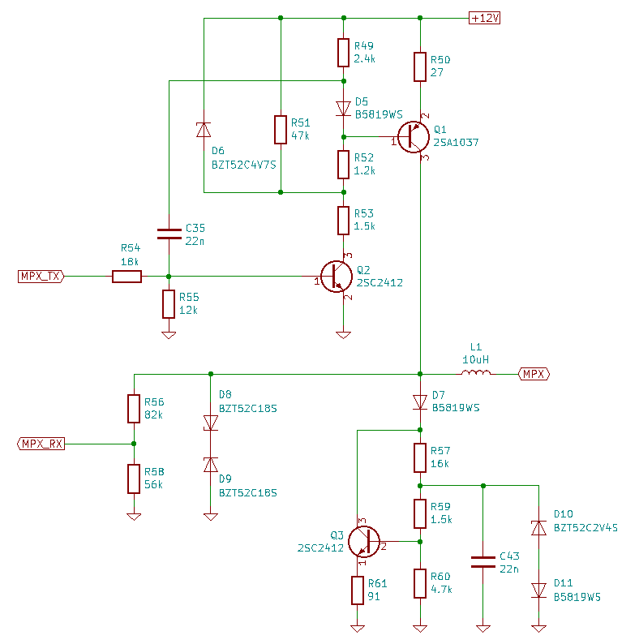

### Description ###

This library is a software driver for MPX (BEAN) bus interface, designed by Toyota and used in some Toyota and Lexus cars. Find the content of the [docs](https://github.com/specadmin/toyota-mpx/tree/master/docs) folder for better understanding of this bus.
The driver works in asynchonous mode and does not block other routings until MPX packets are being received or transmited.

You may found some MPX packets' description [here](MPX-codes.md).

### Physical layer ###

  

### Requirements ###

 * AVR MPU;
 * 12 MHz or higher clock frequency;
 * one external interrupt (PCINT may be used, but not tested yet);
 * one 8 bit timer;
 * GNU AVR C compiller (avr-gcc);

### Limitations ###

 * The driver has NO it's own address. So it receives all the packets, that are being transmited in the MPX network. The driver does NOT filter any packets and does NOT send acknowlegement to any packets.

 * The driver has NO it's own transmission queue. So mpx_send() will return MPX_ERR_BUSY every time until the previous packet will not be sent completely.

### Documentation ###

There is no any special documentation for this library. The library code was written to be efficient and clear for your understanding, so it is full of comments. See the [header file](https://github.com/specadmin/toyota-mpx/blob/master/mpx.h) for methods descriptions. Also you may find a [sample project](https://github.com/specadmin/toyota-mpx/tree/master/samples/MPX-dev-board), that uses this library, inside.

### Adding to your project ###

The library is managed as a git submodule. Please refer to git submodule documentation for better understanding.

 * Run the following command in your project's root directory to clone the library:

`git submodule add https://github.com/specadmin/toyota-mpx lib/toyota-mpx`

 * Include the library's header file, where you need it:

`#include "lib/toyota-mpx/mpx.h"`
